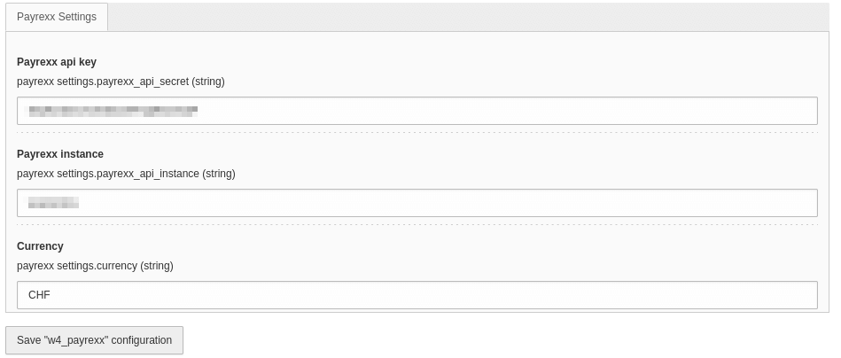
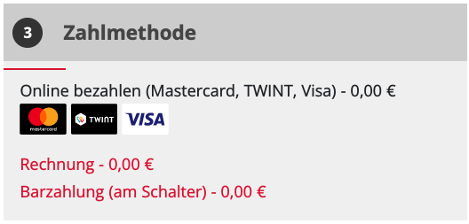

.. include:: /Includes.rst.txt

.. _configuration:

=============
Configuration
=============

The extension is configured in :guilabel:`Settings > Extension Configuration > Configure extensions`:

|
.. list-table:: Explanation
   :header-rows: 1

   * - Field
     - Description
   * - Payrexx api key
     - Your Payrexx api key
   * - Payrexx instance
     - Payrexx instance name
   * - Currency
     - Currency to be used for the payment

Setup
=====

A new payment option has to be added to the :guilabel:`cart` extension. It's done in the setup of the extension :guilabel:`w4_payrexx`:

.. code-block:: typoscript

  plugin.tx_cart {
      payments {
          options {
              10 {
                  title = Online payment
                  provider = payrexx
                  extra = 0.00
                  taxClassId = 2
                  status = open
                  type = payrexx
              }
          }
      }
  }

But the values can be overwritten in your own setup. More info at https://docs.typo3.org/p/extcode/cart/8.2/en-us/AdministratorManual/Configuration/PaymentMethods/Index.html

Getting the payment methods
===========================

The extension comes with a viewhelper, :guilabel:`GetMethods`, to retrieve the available payment methods directly from Payrexx. For instance:

.. code-block:: html

    <html xmlns:f="http://typo3.org/ns/TYPO3/CMS/Fluid/ViewHelpers"
        xmlns:cart="http://typo3.org/ns/Extcode/Cart/ViewHelpers"
        data-namespace-typo3-fluid="true">

    {namespace w4payrexx=W4Services\W4Payrexx\ViewHelpers}

    

        <h5 class="checkout-step-title underline-header">
            
            <f:translate key="tx_cart.controller.order.action.show_cart.block-header.payment_method"/>
        </h5>
        

            <fieldset>
                

                    <f:for each="{payments}" as="payment">
                        <f:if condition="{payment.available}">
                            

                                

                                    <f:if condition="{0: payment.id} == {0: cart.payment.id}">
                                        <f:then>               
                                            <a>{payment.name} <f:render section="Payrexx" arguments="{_all}" /></a>
                                        </f:then>
                                        <f:else>                                                                    
                                            <f:link.action controller="Cart\Payment"
                                                action="update"
                                                arguments="{paymentId:payment.id}"
                                                pageType="2278001" 
                                                class="set-payment">                                   
                                                    {payment.name} <f:render section="Payrexx" arguments="{_all}" />
                                            </f:link.action>
                                        </f:else>
                                    </f:if>
                                

                            

                        </f:if>
                    </f:for>
                

            </fieldset>
        

    

    <f:section name="Payrexx">    
        <f:variable name="names" value="" />
        <f:variable name="cards" value="" />
        <f:if condition="{payment.provider} == 'payrexx'">
            <f:variable name="methods" value="{w4payrexx:GetMethods()}" />
            <f:if condition="{methods.0.id}">
                <f:for each="{methods}" as="method" iteration="iteration">
                    <f:variable name="names" value="{names}{method.name}{f:if(condition: '!{iteration.isLast}', then: ', ')}" />
                    <f:variable name="cards" value="{cards} " />
                </f:for>
            </f:if>
            <f:variable name="cards" value="
{cards}
" />
        </f:if>
        ({names}) - <cart:format.currency currencySign="{cart.currencySign}">{payment.gross}</cart:format.currency>
        <f:format.html>{cards}</f:format.html>
    </f:section>

  </html>

Will prompt something like:

|
