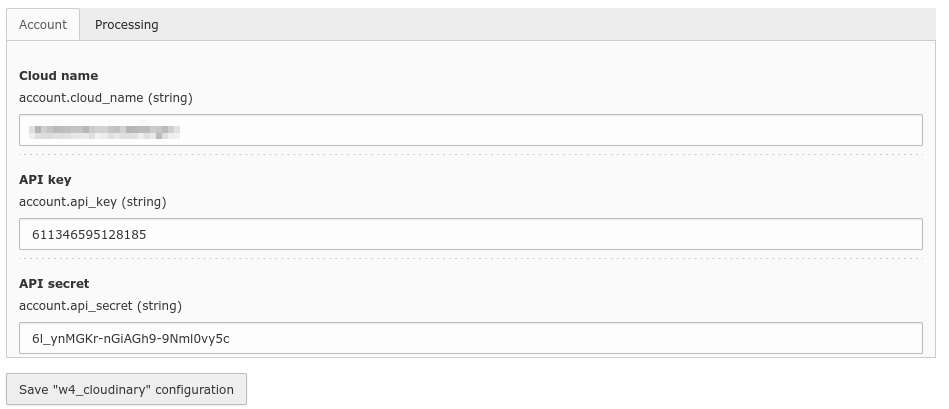

.. include:: /Includes.rst.txt

.. _configuration:

=============
Configuration
=============

The extension is configured in :guilabel:`Settings > Extension Configuration > Configure extensions`:

|
.. list-table:: Explanation
   :header-rows: 1

   * - Field
     - Description
   * - Payrexx api key
     - Your Payrexx api key
   * - Payrexx instance
     - Payrexx instance name
   * - Currency
     - Currency to be used for the payment

Setup
=====

A new payment option has to be added to the :guilabel:`cart` extension. It's done in the setup of the extension :guilabel:`w4_payrexx`:

.. code-block:: typoscript

  plugin.tx_cart {
      payments {
          options {
              10 {
                  title = Online payment (Mastercard, VISA)
                  provider = payrexx
                  extra = 0.00
                  taxClassId = 2
                  status = open
                  type = payrexx
              }
          }
      }
  }

But the values can be overwritten in your own setup. More info at https://docs.typo3.org/p/extcode/cart/8.2/en-us/AdministratorManual/Configuration/PaymentMethods/Index.html